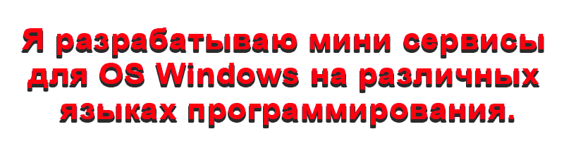
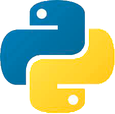
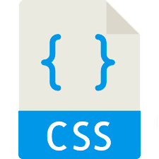

<h1 align='center'></h1>

<h2 align='center'><b>Социальные сети: </b></h2>
<h1 align='center'>

</h1>

<h3>Развиваюсь в технологиях:</h3> 

|  |  |  |  |  |  |  |
| --- | --- | --- | --- | --- | --- | --- |
|  |  |  |  |  |  |  |

          
---

